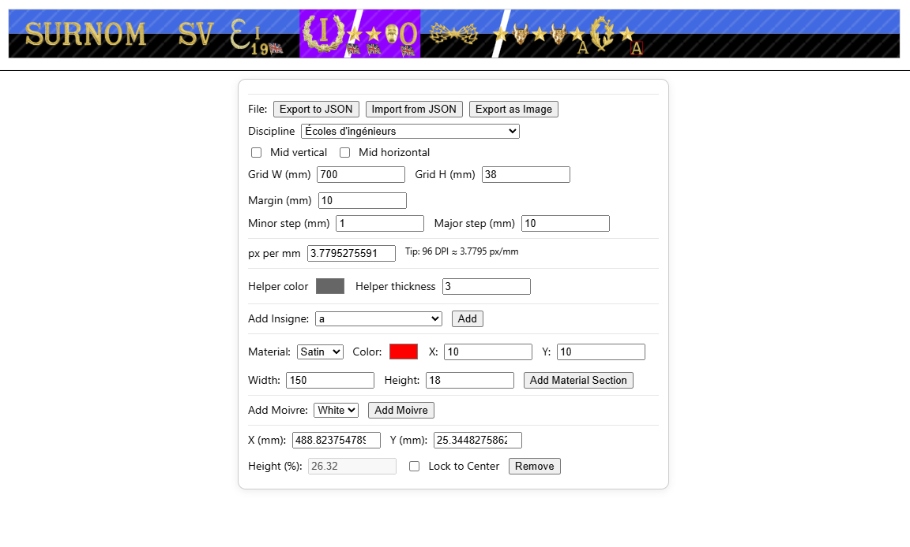

# Fal Designer

Outil pour planifier la création d'une faluche et les ruban et pins nécessaires pour sa confection.

## Planning du projet

- Parcours utilisateur:
    - Choisir le tour de tête
    - Choisir la discipline (matière et couleur(s) selon une liste prédéfinie)
    - Choisir la filière (insigne) qui se placera au centre du circulaire
    - Faire la partie gauche du circulaire:
        - Choisir les insignes du surnom
        - Choisir la/les insignes du bac, son année et les potentielles options (international, drapeaux etc)
    - Faire la partie droite du circulaire:
        - inisignes se succedant de gauche à droite: étoiles, tête de vache, palmes (simple et doubles), 0 et tête de mort
        - options d'insigne: moivre, filière différente, particularités PASS/LASS/prépa,

TODO:
- [x] Ajouter fonctionnalité moivre
- [x] Ajouter fonctionnalité multidisciplines
- [x] Ajouter export/import JSON
- [x] Ajouter export image PNG
- [x] Ajouter Lettres majuscules
- [x] Ajouter Lettres minuscules
- [x] Ajouter Chiffres grands
- [x] Ajouter Chiffres petits
- [x] Ajouter insignes années aux options
- [ ] Ajouter toutes les insignes BAC
- [ ] Ajouter toutes les insignes de filières
- [ ] Ajouter toutes les insignes options (international, drapeaux etc)
- [ ] Ajouter Helper pour les cursus multidisciplinaires et particuliers (PASS, LASS, prépa etc)
- [x] Ajouter fonctionnalité de sauvegarde locale (localStorage)
- [ ] Ajouter les disciplines dont le ruban n'est pas fixe
- [x] Améliorer l'UI/UX

## Insignes à ajouter

### Filières velours
- [x] Chirurgie dentaire > Molaire
- [x] Classes préparatoires santé > Chouette bicéphale
- [ ] Études courtes de santé > Squelette
- [ ] Infirmier > Caducée infirmier
- [x] Kinésithérapie > Caducée de Mercure
- [ ] Licence Accès Santé (LAS) > Emblème de la discipline majoritaire
- [x] Médecine > Caducée médecine
- [ ] Ostéopathie > Sphénoïde
- [x] Paramédical > Ciseaux
- [x] PASS > Tête de mort sur fémurs croisés
- [x] Pharmacie > Caducée de pharmacie
- [ ] Préparateur en pharmacie > Mortier et pilon
- [x] Sage-Femme > Croix d’Ânkh
- [x] Vétérinaire > Tête de cheval

### Filières satins
- [x] Administration Économique et Sociale (AES) > Lettres “AES”
- [x] Architecture > Équerre et compas
- [x] Arts du spectacle > Masque de comédie
- [ ] Arts numériques > @
- [ ] Audiovisuel > Clap de cinéma
- [ ] Bachelors (au RNCP) > β
- [x] Beaux-arts et arts plastiques > Palette et pinceau
- [x] BTS > Lettres “BTS”
- [x] BUT > Lettres “BUT”
- [x] Classes préparatoires > Chouette bicéphale
- [x] Communication > Caducée de Mercure
- [x] Droit > Glaive et balance
- [x] DU > Lettres “DU”
- [x] Écoles d'ingénieurs > Étoile et foudre
- [x] Écoles de commerce, gestion, communication > Caducée de Mercure
- [x] Écoles nationales > Lettres des initiales de l’école
- [x] Filières sportives > Coq
- [x] Géographie > Globe
- [x] Histoire > Casque de Périclès
- [x] Histoire de l’art et archéologie > Sphinx
- [x] IAE > Lettres “IAE”
- [x] IUP > Lettres “IUP”
- [ ] Licence Accès Santé (LAS) > Emblème de la discipline majoritaire
- [x] Lettres et langues > Livre ouvert et plume
- [x] MEEF > Plume
- [x] Musique, musicologie > Lyre
- [x] Œnologie > Grappe de raisin
- [x] Philosophie > φ
- [x] Psychologie > ψ
- [x] Sciences > Palmes croisées de chêne et de laurier avec initiales de la discipline
- [x] Sciences économiques et gestion > Caducée de Mercure
- [x] Sciences politiques > Parapluie
- [x] Sciences sociales > Initiales de la discipline
- [x] Sociologie > Grenouille
- [x] Théologie > ~~Emblème de la religion correspondante~~ ou lettres TH